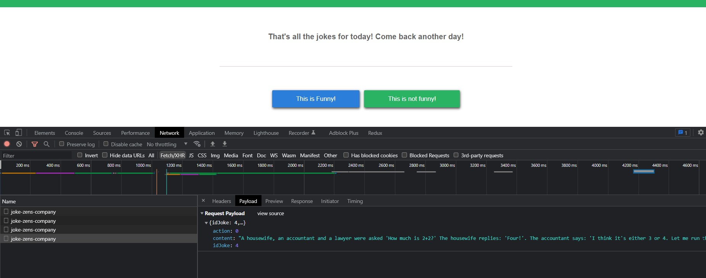
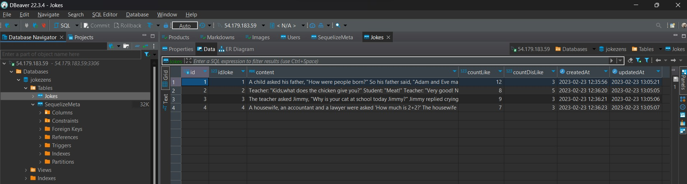

# Xin chào chị Xuân Linh và mọi người.
  Em tên là: Trương Thanh Hòa,</br>
  Email: truongg.thanhhoaa@gmail.com</br>
  Phone: 0794755206,</br>
  Apply position: NodeJs Developer Intern</br>

## Thông tin về bài test frontend 
  Repositories frontend: <a href="https://github.com/minnku17/frontend-joke-ZenS-Company" target="_blank">frontend-joke-ZenS-Company Public</a> </br>
  Deploy to vercel: <a href="https://frontend-joke-zen-s-company.vercel.app/" target="_blank">Joke ZenS Company</a></br>
  Repositories backend: <a href="https://github.com/minnku17/backend-nodejs-joke-zens" target="_blank">backend-nodejs-joke-zens</a> </br>
  Deploy to render: <a href="https://backend-nodejs-zens-company-joke.onrender.com" target="_blank">Backend Joke ZenS Company</a></br>
  Remote xem database deploy to aws ec2:
  ```
    DB_HOST=54.179.183.59
    DB_DATABASE_NAME=jokezens
    DB_USERNAME=user
    DB_PASSWORD=12345
    DB_PORT=3306
    DB_DIALECT=mysql
  ```
In the project directory, you can run:

### `Giao diện frontend`

 
 
### `Save cookie track user`

 
 
 ### `Call api save vote`
 ```
  Đôi lúc sẽ gặp trường hợp call API không được, do em deploy lên render không hỗ trợ chạy nền, đôi lúc em treo sẽ bị stop server ạ.
  Nếu trường hợp lỗi không call api xảy ra em có video sẵn video demo Link bên dưới ạ.
 ```
  <a href="https://drive.google.com/file/d/1rqNfY-1apH1rhnR8hvA1ns9kr3Eew7cM/view?usp=sharing">Video demo website</a></br>
 

### `Database save vote`

 

